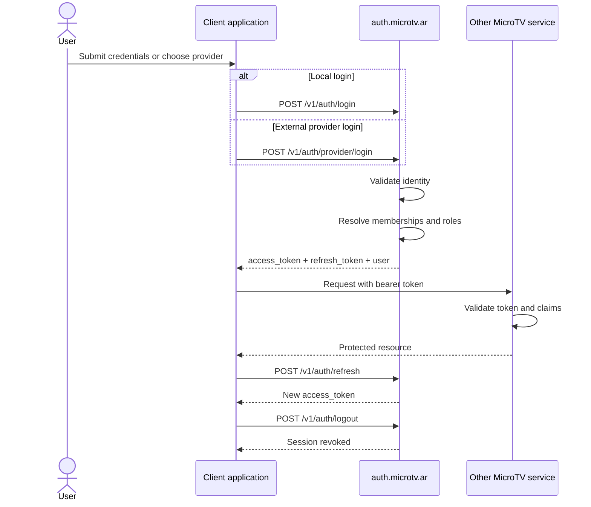

# Authentication Flow Diagram

Source documents:
- ../ARCHITECTURE.md
- ../API_SPEC.md

```mermaid
sequenceDiagram
    actor User
    participant Client as Client application
    participant Auth as auth.microtv.ar
    participant Other as Other MicroTV service

    User->>Client: Submit credentials or choose provider
    alt Local login
        Client->>Auth: POST /v1/auth/login
    else External provider login
        Client->>Auth: POST /v1/auth/provider/login
    end
    Auth->>Auth: Validate identity
    Auth->>Auth: Resolve memberships and roles
    Auth-->>Client: access_token + refresh_token + user

    Client->>Other: Request with bearer token
    Other->>Other: Validate token and claims
    Other-->>Client: Protected resource

    Client->>Auth: POST /v1/auth/refresh
    Auth-->>Client: New access_token

    Client->>Auth: POST /v1/auth/logout
    Auth-->>Client: Session revoked
```
