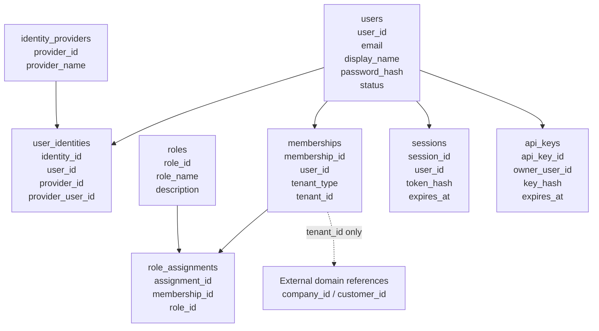

# Identity Domain Model Diagram

Source documents:
- ../ARCHITECTURE.md
- ../DOMAIN_MODEL.md

```mermaid
flowchart TB
    User["users\nuser_id\nemail\ndisplay_name\npassword_hash\nstatus"]
    Provider["identity_providers\nprovider_id\nprovider_name"]
    UserIdentity["user_identities\nidentity_id\nuser_id\nprovider_id\nprovider_user_id"]
    Membership["memberships\nmembership_id\nuser_id\ntenant_type\ntenant_id"]
    Role["roles\nrole_id\nrole_name\ndescription"]
    RoleAssignment["role_assignments\nassignment_id\nmembership_id\nrole_id"]
    Session["sessions\nsession_id\nuser_id\ntoken_hash\nexpires_at"]
    ApiKey["api_keys\napi_key_id\nowner_user_id\nkey_hash\nexpires_at"]
    External["External domain references\ncompany_id / customer_id"]

    User --> UserIdentity
    Provider --> UserIdentity
    User --> Membership
    Membership --> RoleAssignment
    Role --> RoleAssignment
    User --> Session
    User --> ApiKey
    Membership -. tenant_id only .-> External
```
